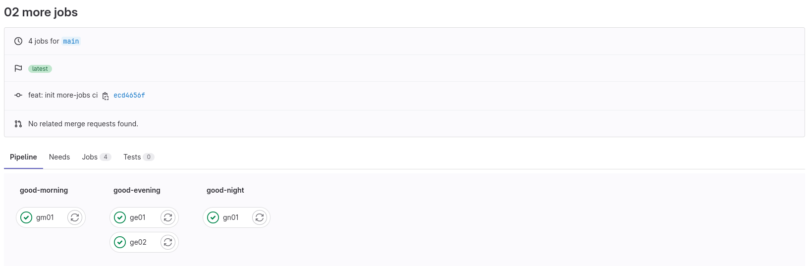

# 02-mulyi-jobs, 在 Pipeline 中執行多個 jobs 並設定執行不同階段

## Run pipeline

- 賦予 jobs 在不同的 stage 中執行，stages 定義時的排序則為執行的順序 <br>
  
- stages 的順序會依照定義時的順序進行
  ```
  good-morning -> good-evening -> good-night
  ```
- 後面的 stage 會等前面的 stage 完成後才開始執行
- 同一個 stage 中的 jobs 在預設的情況下會同時執行，沒有誰先誰後的順序 <br>
  
## Some notes
- `default` 中的設定會套用到所有沒有該設定的 job 上，若 job 中有設定則會以 job 中設定為主（覆蓋 `default` 設定）
  - more-jobs 中的 `default: before_script` 和 `gn-01: before_script` 可看出此現象 <br>
   <br>
  

### Keywords
- `default` : 可對某些設定做 pipeline 全域的設定，會套用到所有沒有該設定的 job 上 <br>
  ref: [default](https://docs.gitlab.com/ee/ci/yaml/#default) 
- `stages` : 自定義 pipeline 所需的執行階段，各階段順序會依照定義時的順序執行 <br>
  ref: [stages](https://docs.gitlab.com/ee/ci/yaml/#stages)
- `before_script` : 顧名思義，如同 `script` 一樣會執行其中所寫的指令，只是會在 `script` 之前執行 <br>
  ref: [before_script](https://docs.gitlab.com/ee/ci/yaml/#before_script)


## 練習
在自己的 GitLab 空間中新增一個 project 進行練習

### 欲達成項目
1. pipeline 在使用瀏覽器 GUI 手動觸發時才會執行
1. 自己定義三個 stages，名稱隨意（這邊使用 `stage1` `stage2` `stage3` 做說明）
1. 在 stage1 和 stage2 中定義一個 job (`st1-1` & `st2-1`)，stage3 中定義兩個 jobs (`st3-1` & `st3-2`)
1. 各 job 都使用 `basic` tag runner 即可

### job 執行內容
- `st1-1`: 共要印出下列訊息
  ```
  Hi! I am sproutBot model 27001

  I work at frontdesk and say 'Hi' 
  ```
- `st2-1`: 共要印出下列訊息
  ```
  Hi! I am sproutBot model 27001

  I work in office and write document 
  ```
- `st3-1`: 共要印出下列訊息
  ```
  Hi! I am sproutBot model 27001

  I work remote and sleep late 
  ```
- `st3-2`: 共要印出下列訊息
  ```
  Good morning! Good evening! and Good night!
  I am openBot model 33031 

  I don't work and I am free
  ```
