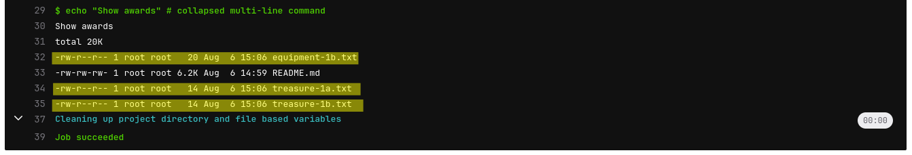

# 04-depending-artifacts
Depending artifacts，傳承

在 GitLab CI/CD 中，Artifacts 是工作（job）產生的檔案，這些檔案會在 job 執行結束後保存起來，供 後續的 job 使用、下載或調試，可以把它想成是「pipeline 中繼檔案」或「暫存成果」，比方說:

```yml
job_name:
  stage: build
  script:
    - make build
  artifacts:
    paths:
      - build/            # 指定要保留的檔案或資料夾
    expire_in: 1 week     # 保存時間（預設是永久）
```

## Some notes
- job 中沒有設定 dependencies 參數時預設會抓取所有已執行 jobs 有產出的 artifacts（`job: level-3-awards`） <br>
  
- 給予 dependencies 參數空 array 來指示不要抓取任何所產生的 artifacts（`job: level-3-easteregg`） <br>
  

### keywords
- `artifacts` : 用來設定要輸出的檔案 / 資料夾路徑 <br>
  ref: [artifacts](https://docs.gitlab.com/ee/ci/yaml/#artifacts)
  - `artifacts:paths` : 指定要輸出成 artifacts 的檔案 / 資料夾 <br>
    ref: [artifacts:paths](https://docs.gitlab.com/ee/ci/yaml/#artifactspaths)
  - `artifacts:name` : 設定 artifacts 下載時打包壓縮檔明（預設為 `artifacts.zip`）<br>
    ref: [artifacts:name](https://docs.gitlab.com/ee/ci/yaml/#artifactsname)
  - `artifacts:when` : 依 job 執行狀況指定 artifacts 產生的時機 <br>
    ref: [artifacts:when](https://docs.gitlab.com/ee/ci/yaml/#artifactswhen)
  - `artifacts:expire_id` : artifacts 的留存時間 <br>
    ref: [artifacts:expire_in](https://docs.gitlab.com/ee/ci/yaml/#artifactsexpire_in)
- `dependencies` : 用於指定當前 job 要抓取哪些 jobs 所產生的 artifacts <br>
  ref: [dependencies](https://docs.gitlab.com/ee/ci/yaml/#dependencies)


## 練習
在自己的 GitLab 空間中新增一個 project 進行練習

### 欲達成項目
1. pipeline 在使用瀏覽器 GUI 手動觸發時才會執行
1. 各 job 都使用 `basic` tag runner 即可
1. 設定兩個 stages（stage 名稱自訂）
    - stage1 中設定 3 個 jobs (jobs 名稱自訂)
    - stage2 中設定 3 個 jobs (jobs 名稱自訂)

### job 執行內容
#### stage1 jobs
1. 各 jobs 當會產生 artifacts 檔案（檔案名稱、內容自訂）
1. 其中 job3 要把檔案們放在 `keep-dir` 資料夾中，並且其中除了產生的 artifacts 檔案外還要有一個名為 `exclude-this.txt` 的檔案
1. job3 產生的 artifacts 指定為 `keep-dir` 資料夾，但不包含其中 `exclude-this.txt` 這個檔案

#### stage2 jobs
1. job1 中要拿到並列出 stage1 中 `job1` 和 `job3` 的 artifacts
1. job2 中要拿到並列出 stage1 中 `job2` 的 artifacts
1. job3 要不抓取任何的 artifacts 
