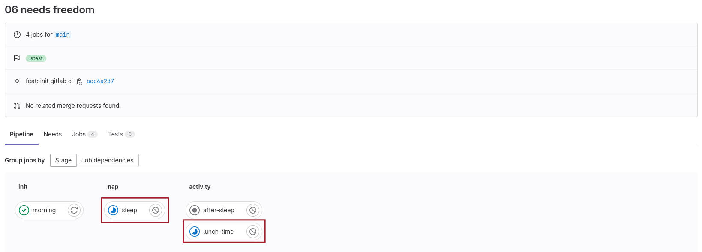
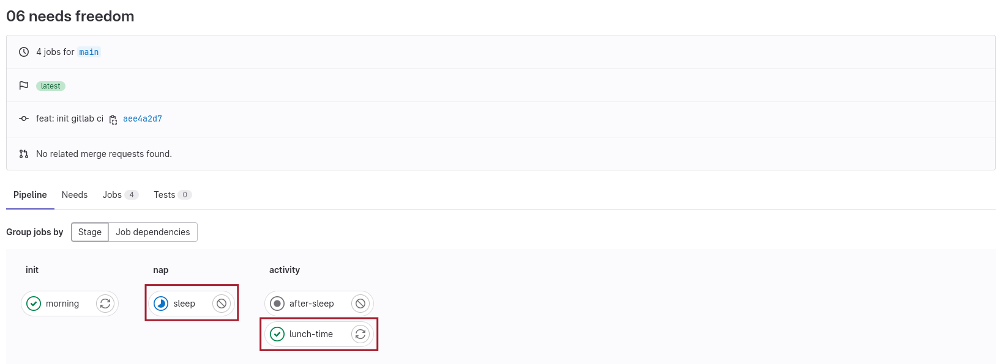

# 06-needs-freedom
Needs freedom, 跳脫束縛

`needs` 像是 `dependencies` 設定，但可以跳脫原本 jobs 在 stages 中的執行順序 

- lunch-time job 在 morning 完成後集開始執行，不論前面 sleep 是否已完成 
    
- sleep 還在執行中時，lunch-time 已完成執行 
    

## Some notes
- 使用 `needs` 時該 job 不會在抓取所有前面所產生的 artifacts，而是只會取得列在 `needs` 項目中的部份（可參考 `needs:artifacts` reference）
- 有使用 `needs` 時 pipeline 頁面可以透過調整 Group by 設定查看 jobs 之間的依附關係（實際執行順序）  

### keywords
- `needs` : 設定 jobs 依附條件，可跳脫預設執行順序  
  ref: [needs](https://docs.gitlab.com/ee/ci/yaml/#needs) 
  - `needs:artifacts` : 對 need job artifact 的額外設定  
    ref: [needs:artifacts](https://docs.gitlab.com/ee/ci/yaml/#needsartifacts)

## 練習
在自己的 GitLab 空間中新增一個 project 進行練習

### 欲達成項目
1. pipeline 在使用瀏覽器 GUI 手動觸發時才會執行
1. 各 job 都使用 `basic` tag runner 即可
1. 設定兩個 stages `init` 和 `check`

### job 執行內容
1. `init` job (in `init` stage) 會產生一個隨機亂數
1. `check-random` job（in `check` stage）檢查 `init` 所產生的亂數，再將該亂數取除以 10 的餘數
     - 如果該亂數是偶數，則正常 exit job
    - 如果該亂數是奇數，則 job `exit 1` (應該會呈現 failure 狀態)
2. `final-check` job（in `check` stage）無論前面的 job 成功與否都要執行，取得 `check-random` 中算出的餘數並輸出至 console
