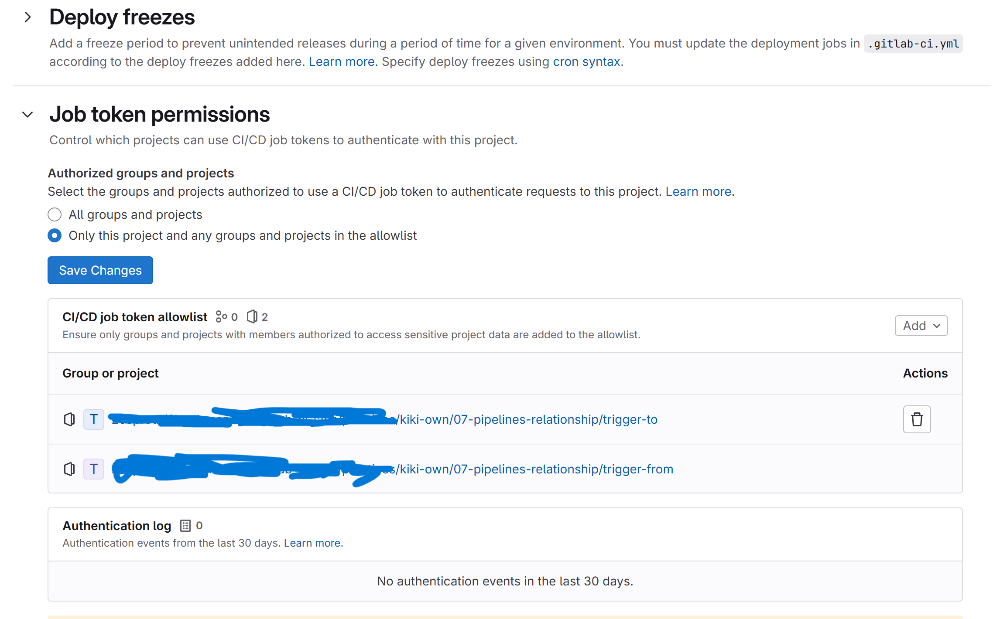

- 若 package 要被其他專案使用，記得要允許其他專案使用自己得 cicd token ，否則會 404
    

## 練習
在自己的 GitLab 空間中新增一個 project 進行練習  
可比照此 Lab 先開一個 Sub Group 再在 Group 中建立 project（這邊的練習和 `trigger-to` 的練習 project 都可開在這個 Group 中）

### from project 的欲達成項目
1. pipeline 在使用瀏覽器 GUI 手動觸發時才會執行
1. 各 job 都使用 `basic` tag runner 即可
1. 在 project 中放置一 `index.html`，檔案中設定一 domain placeholder（其餘 html s內容隨意產生）
1. 設定 project variable `_DOMAIN`
    - Project variables 可從側邊欄 `Settings -> CI/CD` 頁面中的 `Variables` 進行設定  
    ref: [Define cicd variable in ui](https://docs.gitlab.com/ee/ci/variables/#define-a-cicd-variable-in-the-ui)

### from project 的 job 執行內容
1. 將 `index.html` 中的 domain placeholder 替換成 CICD variable `_DOMAIN` 所設定的值
2. 將 index.html 打包並上傳到 package registry 中
3. trigger 另一個 project 的 CICD（此 project 的 CICD 執行內容將描述在 

### to project 的欲達成項目
1. pipeline 會經由 `trigger-from` 的練習 project 觸發
2. 在 `git push` 到 GitLab 上時不應該會觸發 pipeline 執行
3. 各 job 都使用 `basic` tag runner 即可

### to project 的 job 執行內容
1. 抓取 trigger 來源專案的 package
2. 將 package 內容上傳到 GitLab page 上（Package 應該會包含有 `index.html` 檔）  
  ref: [pages](https://docs.gitlab.com/ee/ci/yaml/#pages)
3. 確認可從 GitLab page url 看到正確的頁面內容